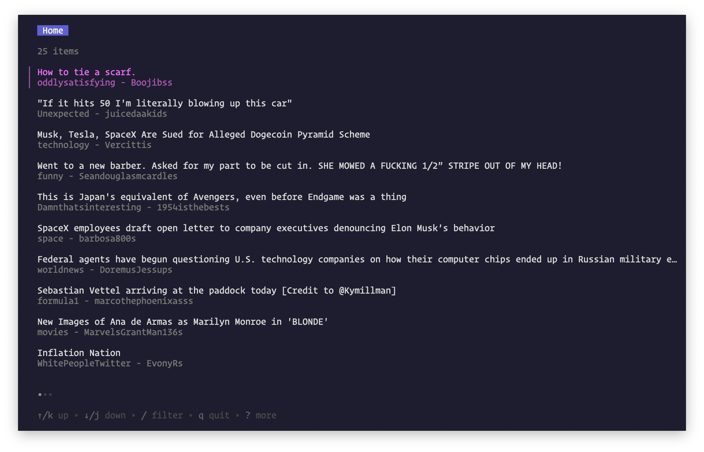

# TED

A TUI for Reddit.
It's mostly just playing around with [Bubble Tea](https://github.com/charmbracelet/bubbletea) and connecting it up with [go-reddit](https://github.com/vartanbeno/go-reddit)

## Usage
To create the credentials required:
- go to https://www.reddit.com/prefs/apps
- create another app
- script
- give it a nice name
- any redirect URI
- create app

To run the app
- set GO_REDDIT_CLIENT_ID to set the client's id.
- set GO_REDDIT_CLIENT_SECRET to set the client's secret.
- set GO_REDDIT_CLIENT_USERNAME to set the client's username.
- set GO_REDDIT_CLIENT_PASSWORD to set the client's password.
- run `go run main.go`

By default it will load your reddit.com homepage equivalent.
Navigate by using the arrow keys, select a post by pressing enter. 
Backspace will take you back to the home view.

## TODO:
- [x] Display posts based on user account
- [x] Display individual posts along with comments
- [ ] Add links to posts so they can be followed to the web.
- [ ] Customise the rendering of the list
- [ ] Style the post screen
- [ ] Load more posts as you go through the list
- [ ] Fetch more comments automatically
- [ ] Allow for "collapsing" of comment/reply threads 
- [ ] Add footer for showing what keys are available
- [ ] Create subreddit browser (so the user can filter through subreddits)